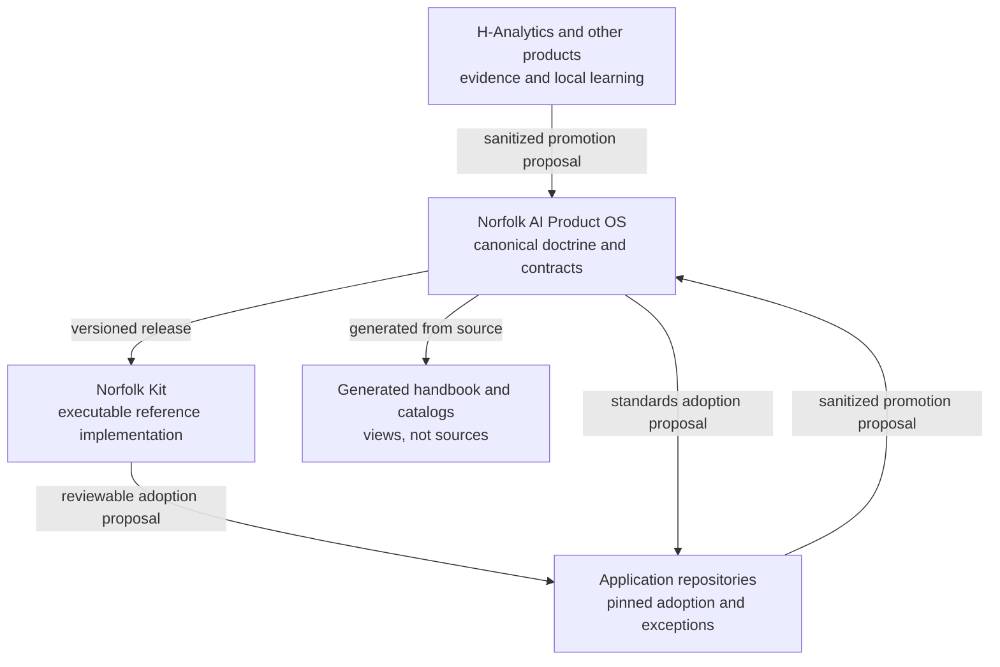
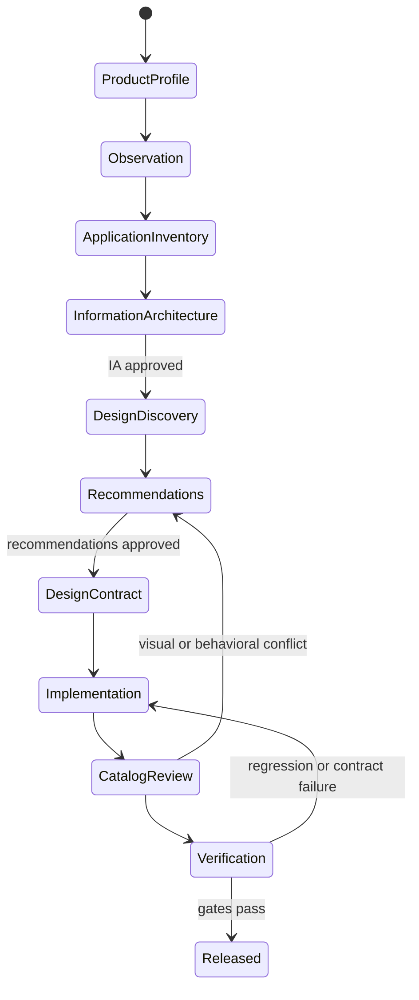
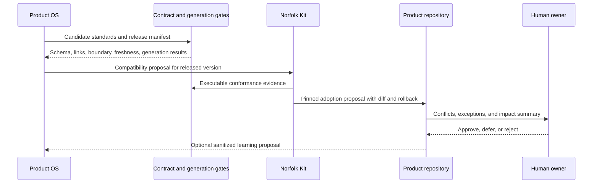
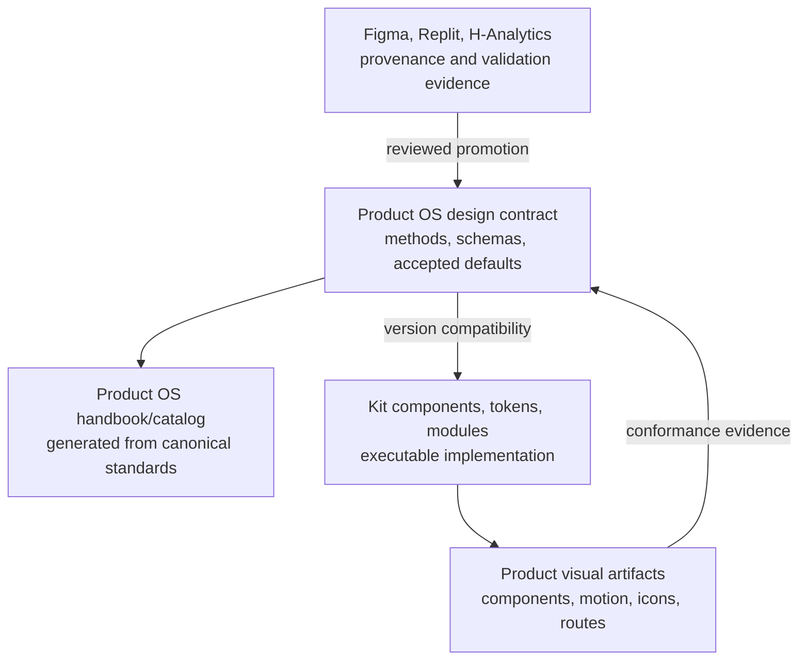

# Establish the Norfolk AI Product OS

## Summary

Create `Norfolk-Group/norfolk-ai-product-os` as Norfolk AI's private, canonical source for product doctrine, design, governance, architecture, security, data, agent-native behavior, reports and exports, and adoption rules. Keep `Norfolk-Group/norfolk-kit` as the executable reference implementation pinned to a released Product OS version. Validate the system against selected H-Analytics workflows without promoting client identity, data, or business rules.

The initial `0.x` release series must make design a first-class operating system rather than a style guide. It must preserve the product-first method, living visual documentation, first-party WorkOS experience, report and export design, motion and honest progress rules, approval gates, and continuous proposal-based learning established in the source conversations.

---

## Problem Frame

Norfolk AI's durable decisions currently live across conversations, Kit brainstorms, Kit decision records, partial design documents, generated HTML artifacts, H-Analytics production patterns, Figma Make originals, Replit exports, and two repositories that no longer have a clear role. The strongest material is valuable, but authority is ambiguous and several claims are stale: Kit describes itself as canonical, its README promises a runnable starter that does not yet exist, Manual became a copied snapshot instead of a renderer, and Starter still represents Clerk/Prisma-era architecture.

The Product OS must solve two different problems without conflating them:

1. Preserve and govern Norfolk AI's product knowledge: what good products are, how decisions are made, and which constraints are binding.
2. Deliver working implementation patterns through Kit without turning Product OS into an application template or letting Kit become a second source of truth.

The main design risk is premature visual standardization. The Product OS must require product understanding, observation, inventory, and information architecture before recommendations or UI work. The main governance risk is copying client-derived material into Norfolk canon without provenance, sanitization, and approval. The main operational risk is writing aspirational gates and catalogs that are not generated or tested.

---

## Repository Targets and Path Convention

- **Product OS:** new private repository `Norfolk-Group/norfolk-ai-product-os`. Paths marked **Product OS** are relative to its root.
- **Kit:** existing `Norfolk-Group/norfolk-kit`. Paths marked **Kit** are relative to its root.
- **H-Analytics:** validation and prior-art source only. Paths marked **H-Analytics** are read-only inputs unless a later, separately approved product plan authorizes changes.
- **Current audit workspace:** `outputs/norfolk-ai-product-os-conversation-audit.md` and `outputs/norfolk-repository-consolidation-plan.md` remain planning evidence, not canonical Product OS content.

---

## Scope Boundaries

### Included

- The canonical Product OS repository, knowledge model, governance, schemas, validators, generated handbook, and release process.
- Product discovery, observation, application inventory, information architecture, and recommendation methodology.
- A substantial design pillar covering foundations, composition, component behavior, responsive design, accessibility, voice, themes, authentication, motion, progress, references, forbidden patterns, and design approval.
- First-class design contracts for reports and exports across PDF, XLSX, PPTX, DOCX, email, charts, and print.
- Preferred stack, architecture, security, data, agent-native parity, human-only approvals, and reusable-module standards.
- A versioned Product OS-to-Kit adoption contract, compatibility matrix, exceptions, and proposal-based learning loop.
- Selective promotion of proven Norfolk-owned material from Kit and sanitized patterns from H-Analytics.
- A validation pilot that exercises one bounded H-Analytics workflow and one motion/progress workflow without redesigning H-Analytics wholesale.
- Migration and retirement gates for Manual and Starter.

### Deferred

- Full remediation of H-Analytics against every Product OS standard.
- A complete domain playbook for every industry. The first release provides the playbook contract and only evidence-backed content.
- Production deployment of every reusable Kit module.
- Vendor swaps, voice-provider selection, agent-runtime selection, or model-fleet repricing unless implementation evidence invalidates an accepted decision.
- Automatic propagation from Product OS to Kit or applications.

### Excluded from Product OS identity

- KIT Capital branding, client data, client credentials, client-specific business rules, or claims that KIT Capital owns or co-authors Norfolk AI IP.
- H-Analytics' Studio Noir palette, H+ labels, specialist personas, or other client/product identity presented as universal Norfolk standards.
- Clerk, Prisma, the old public Next.js scaffold, Replit-hosted databases, or legacy Google/Replit authentication as current standards.
- Repository deletion, branch deletion, PR closure, archive removal, or destructive migration. Each such action requires a later, target-specific approval.

---

## Requirements

### Authority, ownership, and governance

- R1. Product OS is the canonical authority for Norfolk AI product doctrine, standards, decision rationale, governance, and adoption contracts; Kit is an executable consumer of released Product OS versions.
- R2. Norfolk AI owns Product OS and reusable IP; KIT Capital and other organizations are clients whose material cannot enter the canon without sanitization, classification, review, and Norfolk approval.
- R3. Canonical knowledge uses an indexed router, CONTRACT and REFERENCE tiers, freshness metadata, append-only decision records, explicit supersession, and machine-checked links and completeness.
- R4. Authority follows this order within the affected scope: explicit human instruction, approved product-local exception, the application's adopted Product OS version, its compatible Kit implementation, product-local reference material, generated artifacts, then code; a newer unadopted Product OS release has no authority over that application.
- R5. Exceptions record owner, rationale, scope, affected standard, review or expiry date, and migration consequence; expired or unknown exceptions cannot pass as current compliance.
- R6. No destructive repository or content action is bundled into Product OS creation, migration, validation, or adoption.

### Product method and decision quality

- R7. Every product engagement begins with business model, users, jobs to be done, trust, emotion, domain constraints, and success measures before code or visual recommendations.
- R8. Observation and application inventory precede recommendations and cover routes, menus, permissions, dialogs, APIs, jobs, reports, exports, components, states, and known evidence gaps.
- R9. Information architecture is a separate approval gate that decides page necessity, merging, menu structure, workflow simplification, roles, and permission boundaries before visual redesign.
- R10. Recommendations cite evidence and user or business goals, carry confidence, show impact versus effort, identify before-and-after evidence, and require approval at consequential gates.
- R11. Domain playbooks extend the shared system only with evidence-backed adaptations; unresearched domains remain clearly marked as planned rather than filled with plausible prose.

### Design system

- R12. Design is a first-class Product OS pillar comprising method, written contracts, machine-readable metadata, visual catalogs, approval policy, and anti-regression enforcement.
- R13. Product teams discover existing product, brand, theme, component, interaction, and output decisions before proposing a canonical design contract.
- R14. The design contract covers color and semantic tokens, typography and numeric typography, spacing, radius, shadow, iconography, density, composition, components, responsive behavior, accessibility, voice, themes, authentication, state behavior, motion, feedback, and forbidden patterns.
- R15. Shared Norfolk design defaults preserve the accepted monoline Lucide icon system, job-based density, focus-surface width discipline, scan-surface fixed grids, plain concrete voice, and compositional shadcn default without importing product-specific palettes.
- R16. Every reusable component or pattern defines default, hover, focus, active, disabled, loading, error, empty, success, and cancel states where applicable, plus keyboard, responsive, reduced-motion, source mapping, and permitted-deviation metadata.
- R17. Mobile is designed as a first-class surface with 44px targets, safe-area behavior, intentional reflow, and a sheet or equivalent treatment for a desktop copilot panel.
- R18. A design agent reads the approved product, brand, theme, and design contracts; it flags proposed violations and never silently improves or restyles existing screens.
- R19. Design rules cannot be promoted from an unexamined reference; reference records distinguish named, observed, extracted, accepted, rejected, and superseded states.

### Authentication, motion, and outputs

- R20. Product OS defines a first-party authentication experience for login, invitations, recovery, email verification, MFA enrollment, organization choice and switching, SSO routing, session expiry, access denial, loading, and recoverable errors; Kit implements it using WorkOS AuthKit.
- R21. Motion and progress standards preserve provenance from Figma Make through Replit and H-Analytics, require reduced-motion behavior, and show elapsed time honestly; determinate percentages are permitted only when grounded in real stages or measured work.
- R22. Product OS treats PDF, XLSX, PPTX, DOCX, email, charts, and print as designed output families with independent contracts for layout, data completeness, numerical tie-out, overflow, accessibility, and validation.
- R23. Large generated masters and assets live in R2; repositories contain manifests, provenance, URLs, and lightweight golden fixtures rather than large generated binaries.

### Technical and agent-native standards

- R24. The current preferred stack remains Codespaces, Doppler, Railway, WorkOS, Neon and Drizzle, R2 and Stream, Resend, Sentry, tRPC, MCP, Vercel AI SDK, shadcn, Tailwind, and Lucide until superseded by a decision record with fresh evidence.
- R25. Every product capability is implemented once as a transport-neutral authorized application procedure and exposed through UI, tRPC, MCP, copilot, reports, schedules, and future adapters; model and runtime choices remain configuration rather than capability architecture.
- R26. Destructive, legal, payment, external-communication, and other consequential actions use a named human-only approval policy shared across UI and agent paths.
- R27. Data safety includes separate Doppler environments, database self-identification, refusal of destructive work against production, forward-only CI migrations, direct-to-R2 or Stream media transfer, and centralized authorization invariants.
- R28. Official vendor skills, MCP tools, diagnostics, command indexes, and current documentation are checked before integration, and time-sensitive vendor facts carry verification metadata.

### Release, adoption, and learning

- R29. Every Product OS release is versioned and machine-readable, records included standards and compatibility, and generates a human-readable handbook from the same canonical source.
- R30. Kit pins a Product OS release, implements compatible executable patterns, and declares any divergence; applications pin both Product OS and Kit versions plus approved exceptions.
- R31. Product learning flows upstream only through a proposal with provenance, evidence, IP classification, sanitization, impact, and approval; promotion is never automatic.
- R32. Downstream adoption is always a reviewable proposal with compatibility checks and rollback information; no Product OS or Kit release silently rewrites an application.
- R33. Optional capabilities such as animation assignment, document management, photo workflows, and finance are packaged as governed modules with schema, admin, runtime, accessibility, and removal contracts rather than loose files copied everywhere.
- R34. H-Analytics validates the Product OS through bounded evidence slices while remaining a product repository, not a source of Norfolk identity or automatic canon.
- R35. Manual and Starter receive preserve, migrate, archive, close-PR, or delete recommendations only after parity and unique-content checks; each destructive action requires separate explicit approval.
- R36. Standards, releases, proposals, adoption, and exceptions use explicit lifecycle states and semantic-version consequences; unsupported Product OS, Kit, and application combinations fail before mutation.
- R37. Generated handbook and catalog views are private, non-editable outputs that embed release version, source hashes, and freshness and never expose client-derived examples or internal adoption status publicly.
- R38. Visual anti-regression covers representative desktop, tablet, and mobile widths, supported themes, authentication states, component states, and motion and reduced-motion baselines; baseline changes require visible approval.
- R39. Report and export production uses a governed job lifecycle with authoritative input snapshot, calculation version, locale, currency, timezone, rounding, disclosures, provenance, cancellation, retry, expiry, and signed-download behavior.
- R40. Repository retirement readiness includes a restorable preservation bundle of exportable refs, tags, branches, PR metadata, issues, releases, settings, rules, workflows, environments, webhooks, and dependency relationships.
- R41. Kit provides a runnable, tested Express, React, Vite, tRPC, and MCP reference foundation before Product OS units depend on executable auth, catalog, module, or adoption behavior.
- R42. Product OS and adoption automation enforce protected branches, required owners and checks, immutable signed manifests, least-privilege short-lived identities, branch-only writes, release-environment approval, redaction, and actor attribution.
- R43. Client-derived evidence passes a human disclosure review and machine checks for structured identifiers, secrets, paths, URLs, document or image metadata, and indirect disclosure; canonical examples use synthetic replacements.
- R44. Authentication standards cover integrity-protected allowlisted return intent, OAuth transaction integrity, secure cookie and session lifecycle, CSRF, replay protection, rate limits, and redacted security-event logging.
- R45. Visual review uses a pinned rendering environment, named viewport matrix, deterministic capture protocol, navigable review experience, and explicit approve, reject, or defer outcomes.
- R46. Adoption rollback is limited to code and configuration within an expand-and-contract database compatibility window; irreversible data changes require a separate human-approved recovery plan.
- R47. Sensitive artifacts define system of record, roles, retention, legal hold, deletion, backup expiry, and evidence of deletion; signed URL expiry alone is not deletion.

---

## Key Flows

- F1. Product definition to approved design contract
  - **Trigger:** A new product, material feature, or redesign begins.
  - **Steps:** Capture product profile; observe the current product; inventory surfaces and capabilities; approve information architecture; discover existing design; draft recommendations; review evidence and confidence; approve the design contract.
  - **Outcome:** Implementation begins from an approved product and design contract rather than an improvised screen.
  - **Covers:** R7-R19.

- F2. Canonical release to application adoption
  - **Trigger:** Product OS publishes a release.
  - **Steps:** Validate standards and schemas; generate handbook; publish release manifest; update Kit through a reviewable compatibility change; propose application adoption; check exceptions and conflicts; approve, defer, or reject per application.
  - **Outcome:** Every consumer knows what version it follows without automatic rewrites.
  - **Covers:** R29-R32.

- F3. Product learning to Norfolk canon
  - **Trigger:** A product team identifies a reusable design, technical, governance, or workflow improvement.
  - **Steps:** Record provenance and evidence; classify ownership and sensitivity; remove client identity and data; compare against current doctrine; review confidence and impact; approve or reject; land in Product OS first; implement in Kit only when executable support is needed.
  - **Outcome:** Norfolk learns continuously without leaking client material or allowing products to become accidental sources of truth.
  - **Covers:** R2, R10, R19, R31, R34.

- F4. Motion source reconciliation
  - **Trigger:** A motion pattern is considered for the reusable library.
  - **Steps:** Preserve Figma, Replit, H-Analytics, and Kit variants; record lineage; compare visual quality and production behavior; verify accessibility and honest-progress rules; approve a canonical motion contract; create the portable Kit implementation.
  - **Outcome:** The best design intent and the best production behavior are reconciled without losing source history.
  - **Covers:** R16, R21, R33.

- F5. First-party authentication
  - **Trigger:** A user enters or loses an authenticated session.
  - **Steps:** Present Norfolk or client-branded entry; route invitation/open access; handle every WorkOS outcome; preserve return intent; explain denial or recovery; log security-relevant events; test UI and agent authorization against the same policy.
  - **Outcome:** WorkOS remains infrastructure while the user experiences a coherent product-owned journey.
  - **Covers:** R20, R26-R28.

- F6. Repository retirement
  - **Trigger:** Product OS and Kit have absorbed all approved unique value from a legacy repository.
  - **Steps:** Produce unique-content and link report; preserve required history and artifacts; identify open PR disposition; verify no active consumers; present one target-specific destructive proposal; receive explicit approval; perform only the approved action; verify recoverability and references.
  - **Outcome:** Repository count decreases without hidden loss or bundled approval.
  - **Covers:** R6, R35.

---

## Key Technical Decisions

- KTD1. **Product OS owns WHAT and WHY; Kit owns executable HOW.** This resolves the present authority conflict and prevents a starter template from becoming the only place doctrine can be understood.
- KTD2. **Canonical content is structured source; handbook and catalogs are generated views.** A separate copied Manual repository recreates drift, while generated views can be checked against their source.
- KTD3. **Standards carry machine-readable metadata beside readable prose.** Schemas make tiers, ownership, freshness, provenance, exceptions, and compatibility enforceable without reducing standards to configuration files.
- KTD4. **Product understanding and information architecture are gates before design recommendations.** This preserves the product-first method and prevents polished UI work from hardening the wrong workflow.
- KTD5. **The written design contract is memory; agents are consumers.** Agent behavior cannot compensate for missing or contradictory design knowledge, and silent restyling is prohibited.
- KTD6. **Product OS defines catalog contracts; Product OS and Kit generate different views from their own real sources.** Product OS generates its handbook and standards catalog. Kit generates app component, icon, motion, architecture, and navigation specimens from executable code and configuration.
- KTD7. **H-Analytics is validation evidence, not an upstream dependency.** Its mature patterns can prove or challenge Norfolk doctrine, but client identity and implementation quirks cannot become universal defaults.
- KTD8. **Motion promotion reconciles lineage instead of choosing a repository by filename or date.** Figma may hold superior creative intent, Replit the best handoff, H-Analytics the best production behavior, and Kit the portable reference.
- KTD9. **Reports and exports have separate fixed-output design contracts.** Responsive application UI rules do not adequately govern pagination, overflow, print, numerical tie-outs, or investor-facing artifacts.
- KTD10. **Agent-native parity begins at transport-neutral authorized capabilities.** Shared application procedures reduce permission drift, while tRPC, MCP, UI, report, scheduler, and future voice adapters preserve caller-specific execution needs and runtime portability.
- KTD11. **Adoption is pinned, compatible, proposal-based, and reversible.** Automatic downstream updates would erase product-specific judgment and make central mistakes propagate immediately.
- KTD12. **Client safety fails closed.** Unknown repositories, unclassified sources, expired exceptions, and unmatched assets receive the most restrictive treatment until reviewed.
- KTD13. **Accepted Kit ADRs are promoted with provenance and explicit supersession, not copied as timeless truth.** This preserves rationale while allowing Product OS to correct stale names, missing links, and conflicting amendments.
- KTD14. **Large assets and generated masters live outside Git.** R2 is the authoritative binary store; Git remains the reviewable home of manifests, contracts, source, and small fixtures.
- KTD15. **Retirement is a separate terminal workflow.** Creating the canonical system can establish deletion readiness, but cannot authorize deletion.
- KTD16. **Design inheritance is an explicit cascade.** Norfolk foundations feed a domain playbook, client brand, product contract, organization-admin theme, then user appearance and accessibility preferences; lower layers may override only fields their schema permits.
- KTD17. **Brand and product themes are organization-owned; personal settings are bounded preferences.** Organization administrators select approved brand and theme variants, while users may choose supported light, dark, contrast, density, and motion preferences without redefining brand identity.
- KTD18. **Lucide is the sole canonical interface icon library.** The older governance reference to Lucide plus HugeIcons is superseded; migration maps non-Lucide icons to reviewed Lucide or compatible custom 24-by-24 monoline glyphs.
- KTD19. **shadcn inputs are reviewed and pinned.** Kit records registry source, upstream version or commit, content hash, installed files, and local deviations so a block remains reproducible and upgrades remain explicit.
- KTD20. **Generated private views are private GitHub Release artifacts, not a public website.** The `0.x` series attaches self-contained handbook and catalog outputs to the private Product OS release and access inherits repository permissions; any later hosted delivery requires a new authentication and disclosure decision.
- KTD21. **The visual toolchain follows the accepted motion ADR.** Kit uses Storybook React-Vite for executable specimens, Playwright for deterministic capture and interaction, and a single-file Vite build for offline artifacts; Product OS uses a TypeScript source compiler and the same single-file delivery contract.
- KTD22. **A procedure is a transport-neutral application capability.** Capability services own validation, authorization policy, idempotency, transaction and audit behavior; tRPC, MCP, UI, reports, and schedulers are adapters with caller-specific timeouts, streaming, retry, and identity context.
- KTD23. **Private adoption distribution is release-bundle based.** Kit carries the adopter, fetches a pinned private Product OS release bundle through a repository-scoped GitHub App or OIDC identity, verifies its signed manifest and hashes, then opens a branch and PR; consumers never clone or execute unpinned Product OS head.
- KTD24. **The Product OS ships in useful internal increments.** `0.1` establishes canonical governance, product and design contracts, approved source migration, private handbook, and release metadata; later `0.x` releases add outputs, executable Kit modules, adoption automation, and validation without automatic consumer upgrades.
- KTD25. **Imported decision history has its own namespace.** Original Kit ADR filenames, bodies, and dates live under `decisions/imported/norfolk-kit/`; current Product OS decisions use the root sequence and point to imported evidence.

### Canonical lifecycle states

- Standards and ADRs: `draft` → `proposed` → `accepted` → `deprecated` or `superseded`.
- Product OS releases: `candidate` → `released` → `deprecated` → `unsupported`.
- Kit compatibility: `unverified` → `compatible` or `blocked`; a compatible record names a Product OS version range.
- Application adoption: `available` → `proposed` → `adopted`, `deferred`, or `rejected`; an adopted version may become `rollback-requested` or `rolled-back`.
- Exceptions: `proposed` → `approved` → `expired`, `revoked`, or `resolved`. Renewal is an `approved` to `approved` transition that appends an event and updates the review or expiry date. A security or client-boundary exception blocks on expiry; lower-risk exceptions warn until their declared review gate.
- Promotions: `draft` → `sanitization-review` → `Norfolk-review` → `accepted`, `rejected`, or `withdrawn`. Rejected and withdrawn records remain traceable.

### Internal release milestones

- **`0.1` canonical kernel:** U1-U5, U10, and the minimal release-manifest slice of U9. Product OS becomes the authority with private generated views; Kit links to it but makes no executable-conformance claim yet.
- **`0.2` executable reference:** U6-U8 and U12. Kit becomes a runnable reference foundation with output, security, data, agent-native, visual, and first-party WorkOS contracts implemented to the declared compatibility level.
- **`0.3` adoption candidate:** the remaining U9 workflow creates a signed release candidate and compatibility bundle. U11 validates the throwaway app and H-Analytics evidence slices before the candidate is published as a validated release.
- A milestone may be renamed or split by semantic-version rules, but its acceptance boundary cannot silently absorb later work.

---

## High-Level Technical Design

The diagrams express boundaries and lifecycle, not implementation syntax.

### Authority and learning topology

### Product and design lifecycle

### Release and adoption lifecycle

### Design and visual evidence split

---

## Implementation Units

**Dependency order:** U1 → U2 → U12 → U3 → U4 → U5 → U10 → U6 → U7 → U8 → U9 → U11. U-IDs are stable. U12 supplies the executable Kit foundation. U10 precedes the `0.1` release. U9 creates the later validated adoption candidate, and U11 validates it before publication.

### U1. Bootstrap the canonical repository and authority model

- **Goal:** Create the private Product OS repository with a minimal, enforceable knowledge architecture and an explicit supersession of Kit-as-canonical and Manual-as-source.
- **Product OS files:** `README.md`, `AGENTS.md`, `CLAUDE.md`, `CODEOWNERS`, `docs/README.md`, `governance/fundamental-governance.md`, `governance/knowledge-tiers.md`, `governance/approvals.md`, `governance/exceptions.md`, `governance/promotion.md`, `governance/client-boundaries.md`, `governance/repository-security.md`, `decisions/0001-product-os-is-canonical.md`, `decisions/0002-product-os-kit-and-product-roles.md`, `decisions/0003-generated-handbook-not-manual-fork.md`, `docs/plans/`.
- **Kit files:** `README.md`, `AGENTS.md`, `docs/README.md`, `docs/SYSTEM-GOVERNANCE-RULE.md`, `docs/decisions/`.
- **Approach:** Start with the governance kernel, routing index, precedence, tiers, freshness, ADR template, source-role matrix, and repository trust model. Record Kit's prior canonical claim as superseded history. Keep `CLAUDE.md` a bridge to `AGENTS.md`, not a competing contract. Correct root-relative links and avoid duplicating durable rules across agent files. Require protected default branches, owner approval, required checks, branch-only automation, release-environment approval, short-lived scoped identities, redaction, and attributable audit events.
- **Requirements:** R1-R6, R29, R35, R42.
- **Test scenarios:**
  - A manual authority walk-through follows a current rule from root index to owner, tier, decision rationale, and superseded Kit source.
  - A manual boundary review confirms that no creation instruction authorizes a destructive retirement action.
- **Verification:** A reader can determine authority, precedence, ownership, approval, and repository roles from the root index; all initial links resolve under a manual review before U2 automates these checks.

### U2. Implement metadata schemas and blocking contract gates

- **Goal:** Turn governance, releases, adoption, exceptions, and promotions into machine-checkable contracts before substantial content is promoted.
- **Product OS files:** `package.json`, `schemas/standard-metadata.schema.json`, `schemas/product-os-release.schema.json`, `schemas/adoption-lock.schema.json`, `schemas/exception.schema.json`, `schemas/promotion-proposal.schema.json`, `schemas/reference-evidence.schema.json`, `schemas/output-contract.schema.json`, `tools/validate/`, `tests/schemas/`, `tests/contracts/`, `tests/fixtures/`, `.github/workflows/quality.yml`.
- **Approach:** Use small TypeScript validators and JSON Schema for stable interchange. Treat Markdown frontmatter as readable source metadata. Reuse Kit guard lessons: parse paths safely, normalize line endings before hashing, fail closed on unknown classification, and prove each gate with a planted negative fixture. Add a client-evidence intake contract that strips embedded metadata and paths, scans secrets and structured identifiers, replaces examples with synthetic equivalents, and requires human disclosure review before canonical commit. Separate warnings such as 90-day freshness from hard failures unless a binding release claims the stale standard as verified.
- **Requirements:** R2-R6, R19, R23, R28-R32, R42-R43.
- **Test scenarios:**
  - Valid and invalid tier, owner, `lastVerified`, source provenance, and supersession metadata.
  - A CONTRACT standard older than 90 days is visibly stale; a release claiming it as newly verified is rejected.
  - An adoption lock names incompatible Product OS and Kit versions; validation fails with the incompatibility stated.
  - A promotion proposal includes a client name or `client:<id>` asset in canonical payload; validation fails closed.
  - An exception lacks owner, expiry, or migration consequence; validation fails.
  - Unicode paths, LF/CRLF inputs, unknown organizations, and malformed base references do not bypass classification.
  - Direct-default-branch automation, an over-scoped identity, an unsigned release manifest, or a missing owner approval is rejected.
  - Indirect client identifiers, URLs, image metadata, document properties, source paths, and encoded secrets fail intake before canonical history is written.
  - A new canonical doc is absent from `docs/README.md`; the index gate rejects it.
  - An accepted ADR is edited to replace its decision instead of being superseded; the history gate rejects it.
  - `CLAUDE.md` contains a second copy of a binding rule; the duplication check flags it.
  - A Kit document still claims Kit owns doctrine after the transition change; the role-consistency check fails.
  - A destructive retirement instruction appears in an active creation unit; the scope-boundary check flags it for review.
- **Verification:** CI runs schema, index, link, freshness, and client-boundary gates; each gate has observed fail and pass fixtures.

### U12. Make Norfolk Kit a runnable reference foundation

- **Goal:** Create the executable application, test, and artifact foundation required by later Kit units and correct the README promise that currently has no runnable implementation behind it.
- **Kit files:** `package.json`, `pnpm-lock.yaml`, `pnpm-workspace.yaml`, `tsconfig.json`, `vite.config.ts`, `vitest.config.ts`, `playwright.config.ts`, `.storybook/`, `src/client/`, `src/server/`, `src/capabilities/`, `src/adapters/trpc/`, `src/adapters/mcp/`, `src/styles/`, `tests/unit/`, `tests/integration/`, `tests/browser/`, `tools/artifacts/`, `.github/workflows/quality.yml`.
- **Approach:** Establish a TypeScript reference application using Express 5, React, Vite, Drizzle, transport-neutral capability services, tRPC and MCP adapters, Vitest, Playwright, Storybook React-Vite, and the single-file artifact target accepted in the motion ADR. Pin Node, pnpm, browsers, fonts, registries, and dependency inputs. Keep optional modules outside the default runtime until installed through their manifests.
- **Requirements:** R24-R28, R33, R41, R45.
- **Test scenarios:**
  - A clean Codespace installs from the lockfile, starts the reference app, and runs unit, integration, browser, type, lint, build, and artifact checks.
  - A sample capability returns the same authorized result through tRPC and MCP adapters while preserving caller-specific execution context.
  - A human-only sample action refuses agent execution and records the approval requirement.
  - Storybook renders one canonical component through the pinned browser and single-file artifact build without an external request.
  - An optional module is absent from the default bundle and can be installed and removed through a manifest without orphaned configuration.
- **Verification:** A fresh environment can run and test the reference application from documented entry points, and U5, U8, U9, and U11 no longer depend on nonexistent build infrastructure.

### U3. Codify product discovery, observation, inventory, and information architecture

- **Goal:** Make the product-first workflow executable as reusable contracts and templates before any design canon is applied to a product.
- **Product OS files:** `product/product-principles.md`, `product/discovery.md`, `product/observation.md`, `product/application-inventory.md`, `product/information-architecture.md`, `product/recommendations.md`, `playbooks/README.md`, `templates/product-profile.md`, `templates/observation-log.md`, `templates/application-inventory.md`, `templates/information-architecture.md`, `templates/recommendation.md`, `templates/domain-playbook.md`, `schemas/application-inventory.schema.json`, `schemas/domain-playbook.schema.json`, `tests/contracts/product-method.test.ts`, `tests/contracts/domain-playbook.test.ts`, `tests/fixtures/product-method/`, `tests/fixtures/playbooks/`.
- **Approach:** Define separate artifacts for facts, interpretations, and recommendations. Inventory routes, navigation, roles, permissions, dialogs, background work, APIs, reports, exports, component patterns, and state coverage. Recommendation records include evidence, goal, confidence, impact, effort, risk, alternatives, affected surfaces, owner, approval, and review date. The IA gate outputs an approved route/menu/role model before the design contract begins. A material change to product purpose, roles, permissions, inventory, or success criteria invalidates dependent recommendations and returns the workflow to the affected earlier gate.
- **Requirements:** R7-R11, R13, R34.
- **Test scenarios:**
  - An inventory contains design recommendations in an observation-only field; validation rejects the category mix.
  - A recommendation lacks a source observation, product goal, confidence, impact, or effort; validation fails.
  - An IA proposal omits permission ownership for a gated route; the access review fails.
  - A product with no existing UI records that fact and proceeds without inventing observed evidence.
  - A redesign attempts to enter design-contract status before IA approval; lifecycle validation blocks it.
  - A domain playbook contains an unsupported universal claim or invented filler; it remains `planned` and cannot be adopted as evidence-backed guidance.
- **Verification:** A sample product can move from profile through IA with facts traceable to evidence and with no recommendation appearing before its gate.

### U4. Build the canonical design methodology and contract library

- **Goal:** Establish the major design pillar as a complete method and durable contract, preserving accepted Norfolk defaults while separating universal principles from product-specific tokens.
- **Product OS files:** `design/README.md`, `design/method.md`, `design/foundations.md`, `design/composition.md`, `design/components.md`, `design/states.md`, `design/responsive.md`, `design/accessibility.md`, `design/voice.md`, `design/themes.md`, `design/authentication.md`, `design/forbidden-patterns.md`, `design/references.md`, `design/approval-gates.md`, `templates/design-contract.md`, `templates/design-reference.md`, `schemas/design-contract.schema.json`, `schemas/component-specimen.schema.json`, `tests/contracts/design-contract.test.ts`, `tests/fixtures/design/`.
- **Approach:** Promote the accepted Lucide-only, thin-wireframe, density, composition, voice, and shadcn principles with provenance. Convert the empty parts of Kit's design skeleton into templates, not false standards. Encode the inheritance cascade from Norfolk foundation through domain, client brand, product, organization theme, and bounded user preferences. Pin every adopted shadcn registry input by source, version or commit, and content hash. Define state completeness, responsive behavior, keyboard and screen-reader behavior, reduced motion, design exceptions, and agent authority. Keep observed references separate from taste statements until extraction is reviewed.
- **Requirements:** R12-R20, R36, R38.
- **Test scenarios:**
  - A design contract omits numeric typography, error behavior, mobile treatment, or forbidden patterns; validation fails with the missing area.
  - A reusable component lacks focus, loading, error, or reduced-motion metadata where applicable; it cannot enter the accepted catalog.
  - A product palette is labeled as a universal Norfolk token set; ownership validation rejects it.
  - A reference marked only `named` is used as the source of an accepted rule; provenance validation fails.
  - A proposed local variation is added without a governed variant or exception; conformance fails.
  - A user preference attempts to override client brand identity or a product contract field outside its permitted layer; inheritance validation rejects it.
  - A shadcn block changes upstream but the recorded source hash does not; reproduction detects the mismatch before the upgrade is accepted.
- **Verification:** The design contract template can fully describe a new product without importing client identity, and the accepted Norfolk defaults trace to reviewed evidence.

### U5. Deliver living visual catalogs, motion governance, and design regression evidence

- **Goal:** Make design review visual, replayable, accessible, generated, and current while preserving the full animation lineage.
- **Product OS files:** `catalog/README.md`, `catalog/review-experience.md`, `catalog/catalog-contract.json`, `catalog/motion-contract.json`, `handbook/`, `tools/generate-handbook/`, `tools/generate-catalog/`, `design/motion.md`, `design/progress.md`, `design/provenance.md`, `design/viewport-matrix.md`, `design/visual-test-environment.md`, `templates/motion-record.md`, `schemas/motion-record.schema.json`, `schemas/viewport-matrix.schema.json`, `tests/generation/handbook.test.ts`, `tests/generation/catalog.test.ts`, `tests/contracts/motion.test.ts`, `tests/fixtures/motion/`.
- **Kit files:** `src/components/animations/`, `src/components/animations/_replit-export/`, `src/lib/animation-registry.ts`, `src/hooks/useAnimationForCategory.ts`, `docs/design/animations/`, `tools/artifacts/`, `tests/motion/`, `tests/artifacts/`.
- **Approach:** Product OS generates a private, self-contained standards handbook and abstract specimens from canonical source. Kit generates product-facing `components.html`, `motion.html`, `icons.html`, `architecture.html`, and `navigation.html` from real code, tokens, registries, and routes. Outputs embed Product OS and Kit version, source hashes, freshness, approval status, and source paths. The review experience defines landing priority, hierarchy, search, filters, deep links, side-by-side state and theme comparison, motion controls, provenance, CI-diff entry, approve or reject or defer actions, rationale, and exit path. Visual capture pins browser, runtime, fonts, viewport and device scale, orientation, locale, timezone, clock, randomness, animation state, pixel threshold, and retention. Before reconciliation, hash every recovered Figma Make, Replit, H-Analytics, and Kit variant, store immutable versioned copies in R2, verify retrieval, and retain originals. Require honest idle, waiting, indeterminate, determinate, paused or disconnected, retrying, timeout, cancellation-requested, cancelled, late-completion, duplicate-event, failure, and success transitions.
- **Requirements:** R12, R16-R19, R21, R29, R33-R34, R37-R38, R45.
- **Test scenarios:**
  - Handbook and catalog generation are deterministic and committed output matches regeneration.
  - Generated pages make no external requests and open without a server.
  - A long process with no measurable stages displays elapsed time and indeterminate progress, never a fabricated percentage.
  - A staged process reports only server-grounded progress and cannot regress from 70% to 30% without a declared restart.
  - Reduced-motion mode removes nonessential motion while preserving state and completion information.
  - A motion record lacking lineage or approval cannot become canonical.
  - A component, route, icon, or motion source changes without regenerated artifacts; CI fails.
  - A visual baseline changes without an approved design-contract change or explicit baseline approval; CI presents the diff and blocks acceptance.
  - A cancelled job completes late or duplicate progress events arrive; the state machine records the event without presenting a cancelled operation as a normal success.
  - A capture runs with an unpinned browser, missing font, different device scale, live clock, or uncontrolled randomness; it is rejected as non-comparable.
  - A local motion master cannot be retrieved from its recorded R2 object version with the expected checksum; reconciliation stops without deleting the local original.
- **Verification:** Reviewers can inspect all required states, themes, breakpoints, accessibility metadata, source paths, and replayable motion from self-contained files; generation-currentness CI has observed fail and pass fixtures; a selected H-Analytics animation is reconciled against its Figma and Replit sources.

### U6. Establish report, export, and fixed-output design contracts

- **Goal:** Treat generated business materials as product surfaces with their own design, data, and verification rules.
- **Product OS files:** `outputs/README.md`, `outputs/shared-principles.md`, `outputs/job-lifecycle.md`, `outputs/pdf.md`, `outputs/xlsx.md`, `outputs/pptx.md`, `outputs/docx.md`, `outputs/email.md`, `outputs/charts.md`, `outputs/print.md`, `outputs/investor-materials.md`, `templates/output-contract.md`, `schemas/output-contract.schema.json`, `schemas/output-job.schema.json`, `tests/contracts/output-contract.test.ts`, `tests/contracts/output-job.test.ts`, `tests/fixtures/outputs/`.
- **Approach:** Define per-format contracts for purpose, audience, fixed or fluid canvas, typography floor, margins, pagination, overflow, chart semantics, source attribution, confidentiality, numerical tie-out, accessibility, and generated-asset policy. Define queued, running, indeterminate or determinate, cancelling, cancelled, failed, retrying, completed, expired, and download states. Persist one authoritative input and calculation snapshot with locale, currency, timezone, rounding, disclosures, generated-at time, and code or calculation version. Store large masters in R2 and retain lightweight golden fixtures for review.
- **Requirements:** R10, R22-R23, R25-R27, R39, R47.
- **Test scenarios:**
  - A PDF contract allows content below the typography floor or outside controlled margins; validation fails.
  - An investor report fixture contains a number that does not tie to the authoritative calculation snapshot; financial validation fails.
  - An XLSX export omits a filtered or scoped context declared by the request; completeness validation fails.
  - A chart lacks units, source, date basis, or accessible text alternative; validation fails.
  - A generated asset over the Git threshold is committed instead of referenced through an R2 manifest; the large-file gate fails.
  - A long cell, slide title, table, or paragraph exercises defined overflow behavior without clipping silently.
  - Wide tables, empty and partial datasets, stale inputs, font substitution, print margins, precision, and chart rendering preserve the declared format contract.
  - Spreadsheet content attempts formula injection, a recipient lacks authorization, a signed URL expires, or a retry duplicates a job; the output path rejects or resolves the case without leaking data or duplicating delivery.
- **Verification:** Each output family has an accepted contract and at least one lightweight golden fixture covering normal, overflow, empty, and error or unavailable-data states.

### U7. Promote architecture, stack, security, data, and agent-native doctrine

- **Goal:** Convert the strongest Kit ADRs and H-Analytics lessons into current Product OS standards with clear rationale, rejection boundaries, and implementation-time freshness checks.
- **Product OS files:** `standards/preferred-stack.md`, `standards/architecture.md`, `standards/security.md`, `standards/secrets.md`, `standards/data.md`, `standards/data-lifecycle.md`, `standards/media.md`, `standards/agent-native.md`, `standards/repository-lifecycle.md`, `standards/vendor-integration.md`, `standards/reusable-modules.md`, `decisions/`, `decisions/imported/norfolk-kit/`, `templates/decision-record.md`, `templates/module-contract.md`, `tests/contracts/standards.test.ts`, `tests/contracts/agent-parity.test.ts`, `tests/contracts/secrets.test.ts`, `tests/contracts/data-lifecycle.test.ts`.
- **Kit files:** `docs/decisions/0001-*.md` through `docs/decisions/0017-*.md`, `tools/db-guard/assert-target.mjs`, `.mcp.json`, `.cursor/mcp.json`, `.devcontainer/`, `doppler.yaml`, `.env.example`.
- **Approach:** Preserve imported historical ADR text and dates unchanged in the imported namespace, then add Product OS migration metadata and newly numbered superseding decisions rather than rewriting history. Resolve the agent-runtime conflict in favor of late, portable runtime glue and transport-neutral capabilities. Preserve direct media transfers, database self-stamps, environment separation, shared authorization, client-versus-server tool boundaries, official-vendor-first integration, and human-only action classes. Direct-transfer contracts cover expired grants, interrupted or resumable transfer, cancellation, confirmation failure, orphan cleanup, duplicate confirmation, metadata races, quarantine policy, authorization changes, and signed-URL leakage. The secrets contract requires Doppler-only runtime injection, environment-scoped identities, least privilege, redaction, rotation ownership, emergency revocation, break-glass audit, and scans across source, logs, fixtures, manifests, and generated outputs. Data-lifecycle records classify artifacts, roles, system of record, retention, legal hold, deletion, backups, R2 tenant isolation, and deletion evidence. Mark pricing, SDK versions, and current provider behavior as time-sensitive rather than eternal facts.
- **Requirements:** R24-R28, R33, R42, R47.
- **Test scenarios:**
  - A capability exists in a UI route without a corresponding authorized procedure or recorded human-only exception; parity validation fails.
  - UI and MCP callers receive different authorization rules for the same write; shared-policy validation fails.
  - A destructive database task targets staging, production, or an unstamped database; the guard refuses before mutation.
  - An upload implementation proxies bytes through the server or omits grant-time limits; architecture conformance fails.
  - An integration begins without recording vendor skills, MCP, diagnostics, and current official documentation status; adoption readiness fails.
  - A second auth provider, database dialect, storage provider, or runtime dependency appears without a superseding decision; the standards gate fails.
  - Upload confirmation is duplicated, fails after bytes arrive, or authorization changes before download; metadata remains consistent and access is rechecked.
  - A secret appears in a local environment file, CI log, fixture, manifest, or generated handbook; blocking scans reject it and identify the rotation path.
  - A report, rejected promotion, superseded validation record, log, or restoration bundle passes its retention boundary without legal hold; deletion and backup-expiry evidence is required.
- **Verification:** Every current stack choice has rationale, ruled-out alternatives, reversal conditions, owner, and verification date; an application can map each capability to procedure, caller surfaces, authorization, and approval class.

### U8. Define and implement the first-party WorkOS experience and module boundary

- **Goal:** Separate the product-owned authentication journey from WorkOS infrastructure and provide a complete reusable Kit implementation contract.
- **Product OS files:** `design/authentication.md`, `standards/authentication.md`, `standards/auth-security.md`, `templates/auth-experience-contract.md`, `schemas/auth-experience.schema.json`, `tests/contracts/auth-experience.test.ts`, `tests/contracts/auth-security.test.ts`, `tests/fixtures/auth/`.
- **Kit files:** `src/modules/auth/`, `src/capabilities/auth/`, `src/adapters/trpc/auth/`, `src/adapters/mcp/auth/`, `src/components/auth/`, `tools/preflight/workos/`, `tests/auth/`, `docs/artifacts/authentication.html`.
- **Approach:** Product OS defines journey, copy, states, roles, organization behavior, recovery, and approval expectations. The experience contract assigns each state to Kit, WorkOS-hosted UI, or an external identity provider and records controllable branding, copy ownership, redirect and loading transitions, provider exit, and return continuity. Kit uses the backend-driven WorkOS sealed-cookie pattern, follows official skills and diagnostics, and implements every documented authentication result. WorkOS identity never replaces application authorization: tenant membership, role, integrity-protected allowlisted application-relative return intent, and audit events are checked on invitation, session, organization switch, security change, denial, and every protected capability. Security tests cover OAuth transaction state, exact callback origin, secure cookie attributes, session rotation and revocation, CSRF, provider-event replay, rate limits, and redacted logs.
- **Requirements:** R15-R17, R20, R24, R26, R28, R33, R44.
- **Test scenarios:**
  - Login and logout; open and invite-only entry; invitation valid, expired, revoked, and already used; email verification; MFA enrollment and challenge; organization selection; SSO-required; no authorized organization; multi-organization switching; recovery; locked or disabled user; access denial; session expiry and reauthentication; callback failure and retry; and return-to-intent flows.
  - Open-signup and invite-only modes cannot leak behavior into one another.
  - A client-brand configuration cannot read Norfolk-only or another client's assets.
  - A user without permission is denied identically through UI, MCP, and direct capability call.
  - Mobile, keyboard-only, screen-reader, slow-network, provider-error, and reduced-motion journeys remain understandable and recoverable.
  - Vendor preflight detects missing redirect URI or inconsistent environment before the login loop is attempted.
  - Absolute, scheme-relative, encoded, cross-origin, and privileged return targets are rejected before redirect.
  - Callback forgery, reused transaction state, session fixation, CSRF, replayed provider events, and abusive login or recovery rates are rejected and logged without sensitive values.
- **Verification:** The generated auth journey artifact shows every state and transition, and the Kit integration test covers the full documented WorkOS branch set with shared authorization policy.

### U9. Implement release, compatibility, adoption, exception, and promotion workflows

- **Goal:** Make Product OS useful across repositories without allowing silent drift, automatic rewrites, or client-boundary violations.
- **Product OS files:** `adoption/README.md`, `adoption/release-policy.md`, `adoption/compatibility.md`, `adoption/distribution.md`, `adoption/equip.md`, `adoption/tidy.md`, `adoption/rollback.md`, `adoption/cutover.md`, `templates/adoption-lock.json`, `templates/exception.md`, `templates/promotion-proposal.md`, `releases/`, `compatibility/kit.json`, `tools/release/`, `tests/contracts/adoption.test.ts`, `tests/contracts/promotion.test.ts`, `tests/fixtures/adoption/`.
- **Kit files:** `.kit/payloads.json`, `.kit/markers.json`, `.kit/README.md`, `tools/kit-guard/`, `.github/workflows/kit-guard.yml`, `product-os.lock.json`, `docs/product-os-adoption.md`, `tests/kit-guard/`.
- **Approach:** Reframe Equip and Tidy around Product OS releases and Kit compatibility. Keep additive Equip separate from reorganizing Tidy and destructive retirement. Kit's adopter fetches a pinned private release bundle through a scoped GitHub App or OIDC identity, verifies signature and hashes, and writes only to a deterministic branch and PR. Reuse sensitivity sidecars, resumability, reference scanning, conflict detection, most-restrictive unknown defaults, and deletion-only follow-ups. Applications record Product OS version, Kit version, local overrides, approved exceptions, lifecycle state, risk, expected impact, validation evidence, and rollback. Rollback covers code and configuration only inside an expand-and-contract database window; irreversible data change requires backup evidence and a separate approved recovery plan. The two-phase cutover keeps the prior authority text until the Product OS candidate passes, publishes the immutable release, applies and verifies the prepared Kit link update, records cutover state, and restores the prior Kit text if that update fails. Promotion proposals cannot update the canon directly.
- **Requirements:** R2, R5-R6, R29-R36, R42, R46.
- **Test scenarios:**
  - An unchanged managed file updates cleanly; an edited managed file becomes a reviewable conflict rather than being overwritten.
  - An unknown organization receives tooling-only or no payload according to the most restrictive policy.
  - A Norfolk-only asset is planted in a client adoption; blocking CI rejects it, then passes after removal.
  - Product OS and Kit versions are incompatible; adoption stops with a plain-language explanation and no partial changes.
  - A promotion proposal contains client identifiers, missing provenance, or no reviewer; it cannot enter canonical status.
  - Equip and Tidy overlap, an open feature branch touches a target file, or a partial prior run exists; the workflow resumes or refuses safely.
  - A proposed deletion appears in a normal adoption change; it is separated into an unexecuted destructive proposal.
  - An unpinned bundle, bad signature or hash, over-scoped identity, direct default-branch write, or missing environment approval stops before repository mutation.
  - Older code is incompatible with an already-applied schema contraction; normal rollback refuses and names the separately approved recovery plan.
- **Verification:** A scratch Norfolk repository, a scratch client repository, and an unknown-org repository pass the expected adoption matrix, including planted failures and rollback metadata.

### U10. Migrate approved sources with provenance before the first release

- **Goal:** Populate Product OS with approved material and source history before issuing a release, without leaving simultaneous editable canonical copies.
- **Product OS files:** `migration/source-register.md`, `migration/content-dispositions.md`, `migration/superseded-material.md`, `migration/adr-provenance.md`, `decisions/imported/norfolk-kit/`, `tests/contracts/migration.test.ts`, `tests/fixtures/migration/`.
- **Kit files:** `README.md`, `docs/design-system.md`, `docs/decisions/`, `docs/artifacts/`, `src/components/animations/`.
- **Approach:** Register each promoted source with ownership, sensitivity, evidence, disposition, and replacement link. Preserve historical ADR bodies and dates, then attach migration disposition and supersession rather than editing the past. Promote universal rules, convert product blanks into templates, and leave client identity behind. During transition, Kit labels its doctrine as a superseded legacy source pending duplicate-content cleanup and links to the Product OS candidate or release. After cutover, duplicate policy is replaced with concise implementation notes and links.
- **Requirements:** R1-R4, R10-R28, R31, R34, R36, R43.
- **Test scenarios:**
  - Every migrated canonical rule points to an approved source register entry and current Product OS destination.
  - A client-specific label, palette, business rule, or credential-like value is planted in promoted content; migration validation rejects it.
  - A superseded Clerk, Prisma, Kit-canonical, Manual-source, large-binary-in-Git, or legacy auth statement appears as current doctrine; the supersession check fails.
  - An imported ADR body or date differs from its source without a new superseding record; migration validation fails.
  - An imported Kit ADR is placed in the current Product OS decision sequence or collides with an existing number; migration validation fails.
  - Kit and Product OS both contain an editable canonical copy after cutover; authority validation fails.
- **Verification:** Product OS contains only approved and classified material, migrated history remains traceable, and the first release candidate has no unresolved duplicate authority.

### U11. Validate the adoption candidate, publish it, and establish retirement readiness

- **Goal:** Prove the Product OS and Kit relationship on real but bounded evidence, publish the validated candidate, then prepare exact retirement dossiers without performing destructive actions.
- **Product OS files:** `validation/throwaway-application.md`, `validation/h-analytics.md`, `validation/motion-lineage.md`, `validation/report-output.md`, `retirement/preservation-bundle.md`, `retirement/norfolk-starter.md`, `retirement/norfolk-manual.md`, `tests/contracts/validation.test.ts`, `tests/contracts/retirement.test.ts`, `tests/fixtures/retirement/`.
- **Kit files:** `product-os.lock.json`, `docs/product-os-adoption.md`, `src/components/animations/`, `tests/integration/reference-app/`.
- **H-Analytics evidence:** `docs/design-system.md`, `scripts/src/check-ui-canonical.ts`, `docs/discipline/agent-native-parity-map.md`, `docs/slide-system/canonical/`, `docs/plans/2026-06-14-001-feat-animation-governance-plan.md`, selected report/export plans and security/data solution records.
- **Approach:** First validate a throwaway application's full Product OS and Kit adoption against the signed `0.3` candidate. Then select one read-only H-Analytics product and IA slice, one motion and progress slice reconciled with Figma and Replit lineage, and one fixed-output slice. Anonymize evidence and run observation before recommendation. Findings become traceable candidate promotions, not automatic remediation. Publish the candidate only after governance, design, compatibility, rollback, and evidence gates pass. Build and restoration-test preservation bundles where exportable. Starter and Manual receive separate exact-action dossiers naming target, backup location, recoverability, consumer and link checks, open PR or branch disposition, and missing approval.
- **Requirements:** R6, R8-R10, R21-R23, R29-R35, R37-R40, R43, R47.
- **Test scenarios:**
  - A throwaway application adopts compatible versions, exercises rollback, and retains local exceptions through a re-adoption attempt.
  - The selected H-Analytics slice exposes a Product OS gap; the result remains a proposal until Norfolk approval.
  - Client identity or unredacted H-Analytics evidence appears in a validation artifact; publication is blocked.
  - Animation reconciliation attempts to select a master by timestamp or filename without rubric and Ricardo approval; canonical promotion is blocked.
  - A preservation bundle omits an exportable branch, tag, PR record, ruleset, workflow, environment, webhook, or dependency relationship; retirement remains `not ready`.
  - Restoration cannot be demonstrated in a safe target; checksum-only preservation is insufficient and retirement remains `not ready`.
  - Manual or Starter retains unique content or an active consumer; its dossier remains `not ready`.
  - A dossier is ready but lacks exact target-specific approval for deletion, PR closure, or branch deletion; no destructive operation is available.
- **Verification:** The throwaway app and all three H-Analytics evidence slices produce traceable results; preserved repositories can be restored to the verified extent; Starter and Manual have honest readiness states and remain untouched.

---

## Acceptance Examples

- AE1. **Canonical authority:** Given conflicting Kit and Product OS statements, when a reader follows the index and supersession links, then Product OS is current and the Kit statement is preserved only as superseded history. Covers R1-R4.
- AE2. **Observation before recommendation:** Given an existing product, when an audit begins, then route and capability facts are recorded without redesign advice until inventory and IA are approved. Covers R7-R10.
- AE3. **Design completeness:** Given a new product design contract, when it omits responsive, accessibility, state, voice, or forbidden-pattern decisions, then it cannot enter approved status. Covers R12-R18.
- AE4. **Unexamined reference:** Given a named design reference with no inspected evidence, when a rule cites it as authority, then promotion is rejected. Covers R13, R19.
- AE5. **Honest progress:** Given a long task with no measurable stage count, when it runs, then the UI shows elapsed time and indeterminate progress without a fabricated percentage. Covers R21.
- AE6. **First-party auth:** Given WorkOS returns MFA enrollment or organization selection instead of success, when the user completes login, then the product renders the branded next step and preserves return intent. Covers R20, R28.
- AE7. **Financial output:** Given an investor report value differs from the authoritative calculation, when output validation runs, then release fails even if the PDF is visually correct. Covers R22, R25-R27.
- AE8. **Client isolation:** Given a KIT Capital or H-Analytics asset appears in canonical payload without sanitized approval, when client-boundary validation runs, then release fails closed. Covers R2, R31, R34.
- AE9. **Pinned adoption:** Given a Product OS release is compatible with a Kit version, when an application receives the proposal, then it can approve, defer, or reject with its existing exceptions and rollback path visible. Covers R29-R32.
- AE10. **Edited managed file:** Given an application changed a Kit-managed file, when a later adoption runs, then the file is flagged as a conflict and is never overwritten silently. Covers R30-R32.
- AE11. **Learning promotion:** Given H-Analytics proves a stronger motion behavior, when the learning is proposed, then it is sanitized and approved in Product OS before Kit or other products receive it. Covers R21, R31, R34.
- AE12. **Deletion boundary:** Given Manual passes every retirement-readiness check, when no explicit target-specific deletion approval exists, then the repository remains untouched. Covers R6, R35.
- AE13. **Repository trust:** Given an adoption identity can write directly to a default branch or read unrelated repositories, when preflight runs, then the workflow refuses before fetching or writing. Covers R42.
- AE14. **Semantic disclosure:** Given a client-derived screenshot has no visible client name but retains a source path, URL, or embedded identity metadata, when intake runs, then canonical commit is blocked pending synthetic replacement and human disclosure review. Covers R43.
- AE15. **Auth integrity:** Given a post-login return target is absolute, cross-origin, encoded, or privileged, when the callback completes, then the target is rejected and the user returns to an allowlisted product route. Covers R44.
- AE16. **Deterministic visual review:** Given a baseline capture uses a different browser, font, device scale, clock, or randomness seed, when comparison runs, then the capture is rejected as non-comparable rather than accepted as a design change. Covers R45.
- AE17. **Safe rollback:** Given a release contains a schema contraction that older code cannot read, when normal adoption rollback is requested, then it refuses and routes to the separate approved recovery plan. Covers R46.
- AE18. **Retention is deletion:** Given a signed report URL expires, when the artifact reaches its retention boundary without legal hold, then the R2 object and eligible backups follow the deletion policy and retain deletion evidence. Covers R47.

---

## System-Wide Impact

### Authority and documentation lifecycle

Existing Kit documents and ADRs remain valuable history but stop being the portfolio authority. Product repositories will need a pinned adoption file and a local contract that clearly distinguishes inherited standards from product decisions. Agent entry files become routers into one durable knowledge graph rather than duplicated memory documents.

### Design and delivery lifecycle

Design work gains formal entry and approval gates. This adds modest up-front structure but reduces expensive UI churn, invented standards, and agent regression. Generated catalogs become required review evidence; source changes that affect visible behavior without regenerated artifacts fail rather than drifting silently.

### Authentication and authorization

The first-party WorkOS contract expands the tested state surface beyond the happy path. Shared procedures and authorization policies must serve UI, MCP, copilot, and direct callers. The human-only approval list becomes a cross-product security boundary and must be applied consistently to external communication, money, legal actions, migrations, and deletion.

### Data and binary lifecycle

Database environment identity and destructive guards become portfolio doctrine. Product OS stores contracts and small fixtures; R2 stores large masters and generated assets. Migration and adoption manifests must preserve provenance and hashes without turning client binaries into canonical repository content.

### Release and failure propagation

Product OS release failure blocks Kit adoption. Kit incompatibility blocks application adoption. An application conflict never rolls back the central release; it remains on its prior pinned version. Partial adoption is resumable and reviewable. Promotion and retirement are separate workflows, so a successful migration does not imply approval to delete a source repository.

### Operational ownership

Norfolk AI owns standards, releases, compatibility decisions, and promotion approval. A named **Product OS Owner** approves releases, resolves tier and exception disputes, and assigns freshness reviewers; U1 must record the initial individual before the first candidate is accepted. Product owners own local adoption and exceptions. Client repositories remain responsible for their data, identity, and product-specific rules.

---

## Risks and Dependencies

| Risk or dependency | Consequence | Mitigation |
|---|---|---|
| Canonical repository does not yet exist | Plan paths cannot be implemented in place | Create the private Norfolk repository in U1, then land the governance kernel before migration. |
| Kit claims exceed its implementation | Consumers may trust nonexistent app, CI, or artifact behavior | Treat claims as gaps, add planted tests, and update README during role transition. |
| Client material is promoted as Norfolk IP | Confidentiality, ownership, and brand-boundary failure | Fail-closed source register, sensitivity classification, sanitization review, and negative fixtures. |
| Design scope becomes a visual-style exercise | Product and IA defects become polished instead of fixed | Enforce F1 lifecycle gates and validate facts, recommendations, and approvals as separate states. |
| Catalogs are hand-maintained or aspirational | Visual documentation drifts from code and routes | Generate from real sources, commit outputs, and fail CI on regeneration differences. |
| Figma lineage is incomplete or chronology is misleading | A lower-quality export may be chosen as canonical | Preserve all `.make` archives and compare visual intent with Replit and H-Analytics behavior before approval. |
| H-Analytics patterns carry client identity | Product-specific design becomes false Norfolk doctrine | Validate patterns by behavior and strip names, palettes, data, and personas before proposal. |
| Vendor behavior or pricing changes | Accepted stack detail becomes stale | Require `lastVerified`, official-source checks at implementation, and superseding ADRs for material changes. |
| Auth branch coverage is incomplete | Users fail outside happy-path login and authorization diverges | Use WorkOS official tooling, enumerate every result, and test shared authorization through all callers. |
| Financial output looks correct but contains wrong data | Investor-facing harm | Tie output fixtures to authoritative calculations and make numerical validation blocking. |
| Product OS release breaks Kit or applications | Central error propagates portfolio-wide | Compatibility matrix, pinned versions, opt-in adoption, explicit rollback, and no automatic upgrades. |
| Manual or Starter is deleted too early | Unique history or active links are lost | Retirement dossiers, consumer/link scans, recoverability check, and separate target-specific approval. |
| Product OS becomes documentation bloat | Agents stop reading it and freshness decays | Minimal-and-true rule, indexed router, tiers, ownership, 90-day review signal, and deletion or supersession of filler. |

---

## Resolved During Planning

- The repository name is `Norfolk-Group/norfolk-ai-product-os`, private and Norfolk-owned.
- Product OS is canonical; Kit remains and becomes its versioned executable implementation.
- Manual is not a permanent parallel handbook repository. Its useful concept is retained as generated Product OS presentation.
- WorkOS replaces Clerk in current doctrine.
- H-Analytics is the best known production animation and design-enforcement source; local Figma Make archives may contain higher-fidelity creative intent; Replit preserves the best known export handoff.
- H-Analytics, H-Analytics Figma Design, and Kit are preserved during reconciliation.
- Starter is the first likely deletion candidate and Manual the second, but neither is deleted by this plan.
- No external vendor comparison is required to choose the current stack. Implementation must reverify time-sensitive details from official sources before coding each integration.

---

## Documentation and Operational Notes

- Product OS releases use semantic versions and immutable release manifests. A release note names added, changed, deprecated, and superseded standards plus the minimum compatible Kit version.
- CONTRACT standards require an owner and `lastVerified`; stale standards remain visible and cannot be presented as freshly verified.
- Generated handbook and catalog outputs are review artifacts, not editable sources.
- Product repositories record adoption in a machine-readable lock plus a concise human-readable summary of local exceptions.
- Retirement dossiers end with one of `not ready`, `ready for archive decision`, `ready for deletion decision`, or `retained`; `ready` is not authorization.
- The internal release series begins at `0.1` after the canonical-kernel milestone. U9 selects the adoption-candidate version from completed scope, and U11 publishes it only after governance, design, adoption, rollback, and H-Analytics validation gates pass together.

---

## Sources and Research

### Current planning evidence

- `outputs/norfolk-ai-product-os-conversation-audit.md` — authoritative synthesis of the current task and the earlier design conversation.
- `outputs/norfolk-repository-consolidation-plan.md` — MCP-verified Kit, Manual, and Starter inventory, ownership boundary, animation provenance, and retirement gates.

### Norfolk Kit evidence

- `docs/SYSTEM-GOVERNANCE-RULE.md` — precedence, tiers, ADRs, freshness, enforcement, and generated visual-artifact doctrine.
- `docs/design-system.md` — accepted icon, composition, density, voice, reference, and design-engagement rules plus unpopulated project-specific sections.
- `docs/brainstorms/2026-07-31-core-stack-requirements.md` — preferred stack, repository verbs, organization boundaries, artifacts, and agent architecture.
- `docs/brainstorms/2026-07-31-copilot-and-parity-requirements.md` — shared procedure core, copilot surfaces, UI-driving tools, and human-only exceptions.
- `docs/brainstorms/2026-07-31-designer-agent-requirements.md` — design contract before designer agent and flag-without-silent-change authority.
- `docs/brainstorms/2026-07-31-prebuilt-app-modules-requirements.md` — governed optional modules instead of loose component payloads.
- `docs/brainstorms/2026-07-31-themes-responsive-voice-requirements.md` — theme, mobile, and future voice constraints.
- `docs/decisions/0001-the-stack.md` through `docs/decisions/0017-the-app-shell-is-assembled-from-shadcn-blocks.md` — stack, media, data, motion, hosting, embeddings, agents, environments, vendor tooling, and shell rationale.
- `docs/plans/2026-07-31-001-feat-core-stack-buildout-plan.md` — Equip/Tidy safety model and live guard failures worth converting to tests.

### H-Analytics and motion evidence

- `docs/design-system.md` and `scripts/src/check-ui-canonical.ts` — mature design contract and blocking enforcement pattern.
- `docs/discipline/agent-native-parity-map.md` — capability parity evidence.
- `docs/slide-system/canonical/` — fixed-output contracts and self-validation loop.
- `docs/plans/2026-06-14-001-feat-animation-governance-plan.md` — production motion assignment and honest-progress behavior.
- `docs/solutions/` records on agent parity, authorization-before-write, CSRF coverage, agent-memory drift, and safe database migration — institutional patterns for shared enforcement.
- `src/components/animations/`, `src/components/animations/_replit-export/`, local Figma Make archives, and H-Analytics deployed animation components — creative and production lineage to reconcile in U5 and U10.
